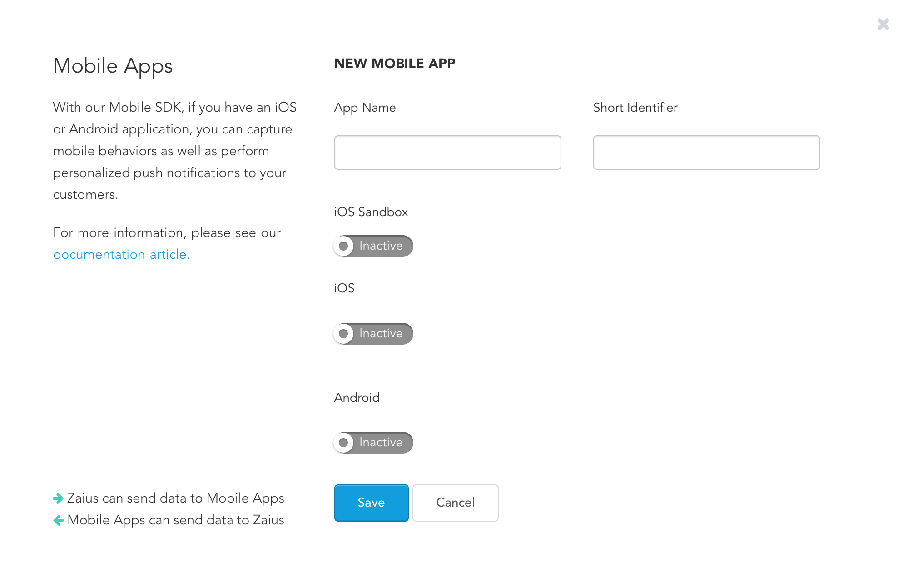

# Getting Started

Visit **Account Settings** -&gt; **Apps & Data** -&gt; **Mobile Apps** and create a mobile app that you will refer to in your integration and when sending campaigns. 


Each app needs a name and identifier.



Apps are cross platform, meaning if you have an app that is available on both iOS and Android you should create a single app to represent them within Zaius.


Once you've created the app you need to upload the appropriate certificate and/or API keys so that we may send to your users.

